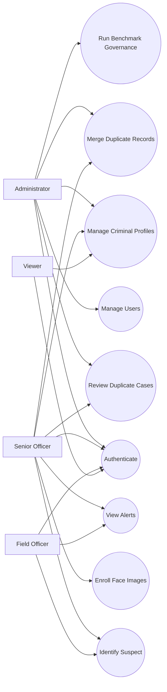
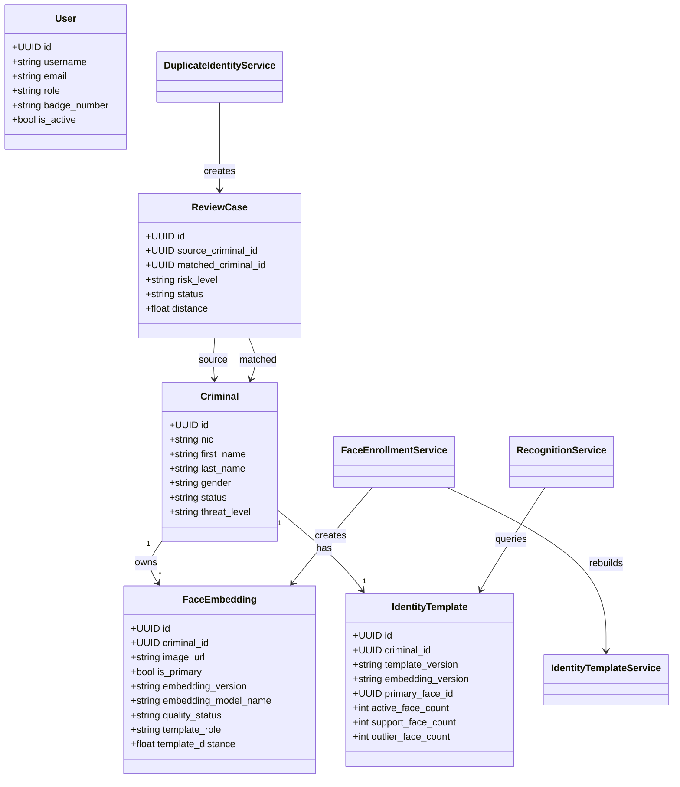
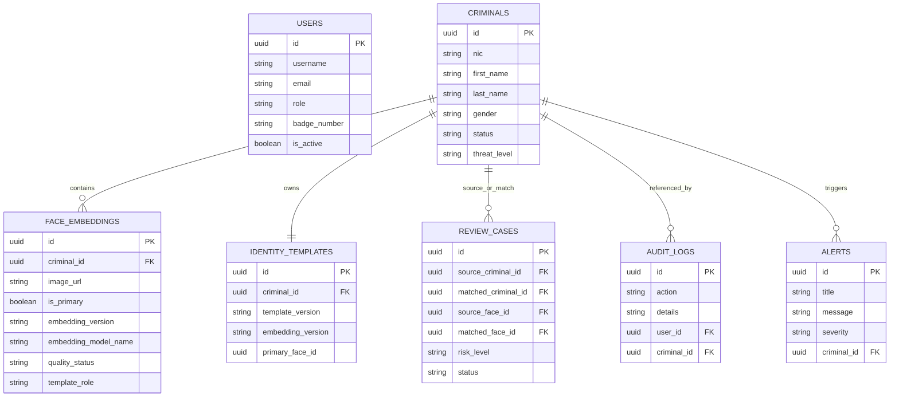
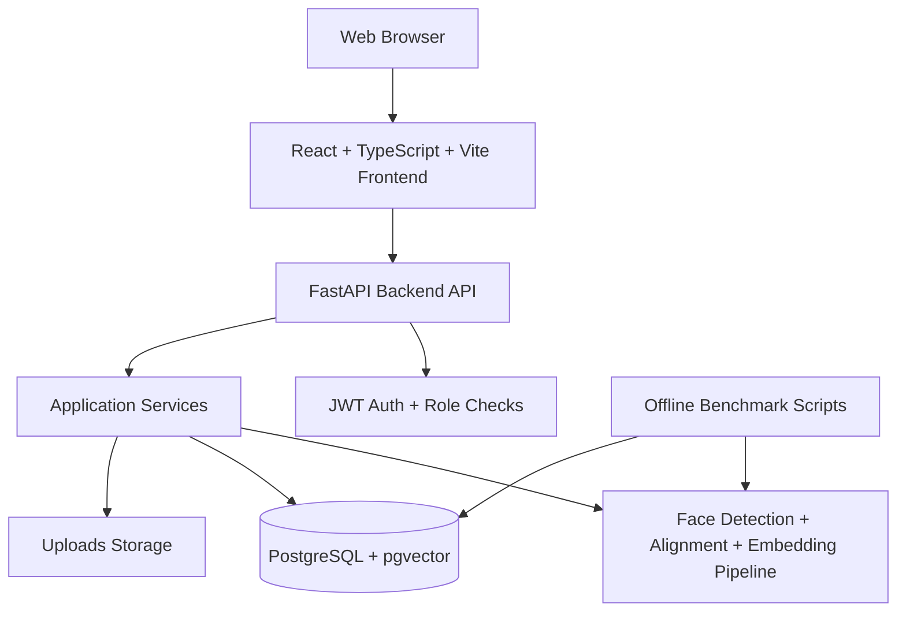

# Interim Report
## TraceIQ: Intelligent Criminal Identification System

Author note: This Markdown draft is structured to match the interim report guideline in [gidelines.md](/Users/dasuncharuka/Documents/projects/face/gidelines.md). When preparing the final submission, add the university-provided cover page, page numbers, and export this document to PDF using the required file name format.

## Table of Contents

1. Chapter 01 Introduction
   1.1 Introduction
   1.2 Problem Definition
   1.3 Project Objectives
2. Chapter 02 System Analysis
   2.1 Facts Gathering Techniques
   2.2 Existing System
   2.3 Drawbacks of the Existing System
3. Chapter 03 Requirements Specification
   3.1 Functional Requirements
   3.2 Non-Functional Requirements
   3.3 Hardware / Software Requirements
   3.4 Networking Requirements
4. Chapter 04 Feasibility Study
   4.1 Operational Feasibility
   4.2 Economical Feasibility
   4.3 Technical Feasibility
5. Chapter 05 System Architecture
   5.1 Use Case Diagram
   5.2 Class Diagram of Proposed System
   5.3 ER Diagram
   5.4 High-level Architectural Diagram
6. Chapter 06 Development Tools and Technologies
   6.1 Development Methodology
   6.2 Programming Languages and Tools
   6.3 Third-Party Components and Libraries
   6.4 Algorithms
7. Chapter 07 Implementation Progress
   7.1 Development Environment Setup
   7.2 Implemented Features
   7.3 Screenshots / Code Snippets
   7.4 Challenges Encountered and Solutions
   7.5 Current System Limitations
8. Chapter 08 Discussion
9. References
10. Appendixes

## List of Figures and Tables

- Figure 1: Use Case Diagram of TraceIQ
- Figure 2: Class Diagram of Proposed System
- Figure 3: ER Diagram
- Figure 4: High-level Architectural Diagram
- Table 1: Core Functional Requirements Summary
- Table 2: Non-functional Requirements Summary
- Table 3: Development Tools and Technologies
- Table 4: Current Implementation Progress by Module

# Chapter 01 Introduction

## 1.1 Introduction

Law enforcement agencies increasingly depend on digital systems to manage criminal data, track investigations, and respond quickly to incidents. Traditional record handling approaches, which rely on paper files, disconnected spreadsheets, station-level data silos, and manual telephone verification, are too slow for modern investigative work. These methods make it difficult to search past offenders, compare suspects across districts, and maintain reliable evidence trails. In time-sensitive situations, such as patrol checks, checkpoint operations, or suspect verification after a complaint, delays in identity confirmation can reduce officer safety and weaken operational efficiency.

Face recognition has emerged as a promising support technology for criminal identification because it allows investigators to compare a query image against a database of known individuals. However, practical deployment is not only a machine learning problem. A reliable identification system also requires structured record management, secure authentication, audit logging, data quality validation, repeatable evaluation, and operator workflows for reviewing uncertain results. A weak or uncalibrated recognition pipeline may produce false matches, duplicate records, or unsafe confidence estimates. Therefore, the success of this project depends on building an end-to-end information system rather than only training a model.

TraceIQ was proposed as an intelligent criminal identification system for use in a law-enforcement context. The main idea is to combine a centralized criminal database, a face-recognition engine, a web dashboard for officers, and governance workflows that make recognition decisions more explainable and auditable. The current implementation is a web-based prototype with a FastAPI backend, a React frontend, a PostgreSQL database using pgvector, and a face embedding pipeline based on MTCNN and a custom TraceNet model. During development, the project evolved further to include enrollment quality controls, duplicate-person detection, criminal-level identity templates, benchmark governance, and operator review workflows.

This interim report documents the project as a formal academic checkpoint. It explains the problem domain, analyzes the current situation, specifies the system requirements, evaluates feasibility, describes the architecture, and records actual implementation progress. The report also reflects key changes from the original project direction. In particular, the system has moved from a basic nearest-neighbor prototype toward a more advanced, measurable, and safer recognition platform that emphasizes explainability, data quality, and model governance.

## 1.2 Problem Definition

The core problem addressed by this project is the absence of a centralized, accurate, and operationally useful criminal identification system that supports both record management and rapid facial identification. In many practical contexts, criminal records are fragmented across different sources, not consistently digitized, and difficult to retrieve in real time. Even when mugshots exist, they are often stored without structured embeddings, versioning, or quality checks. As a result, officers cannot reliably identify individuals from field images or quickly determine whether a person is already known to the system.

The problem is not limited to storage. Recognition quality itself becomes unreliable when poor images are enrolled, multiple records are created for the same person, or thresholds are chosen without evidence. A system that returns a wrong match is more dangerous than a system that returns no match. Therefore, the real problem has three measurable parts:

- criminal identity data is not stored in a unified, searchable structure
- face recognition results are unsafe when enrollment quality, duplicate identity control, and benchmark calibration are missing
- operational users need a reviewable workflow, not a black-box prediction

In project terms, the problem can be stated as follows:

The current criminal identification process lacks centralized data management, quality-controlled facial enrollment, calibrated recognition decisions, and operator review support, causing delayed identification, inconsistent records, and unsafe or unreliable automated matches.

## 1.3 Project Objectives

The objectives of TraceIQ are:

- To design and implement a centralized web-based criminal identification and record management system
- To provide secure user authentication with role-based access control for administrative and operational users
- To enable officers to create, update, search, review, and manage criminal profiles efficiently
- To allow enrollment of multiple facial images for a single criminal so that different poses and appearance variations can be represented
- To generate and store face embeddings in a vector-searchable format for identification
- To improve recognition safety by introducing quality gates, landmark-based alignment, duplicate-person screening, and identity templates
- To provide explainable recognition decisions such as `match`, `possible_match`, and `unknown` instead of a single unsafe guess
- To add review workflows for duplicate records and suspicious recognition outcomes
- To build an offline benchmark and governance workflow so that threshold or model changes are based on evidence
- To create a platform that can later support safer model upgrades, re-embedding, and future mobile integration

# Chapter 02 System Analysis

## 2.1 Facts Gathering Techniques

The project requirements were not defined by assumption alone. Several fact-gathering techniques were used throughout planning and implementation.

The first technique was document analysis. Existing project documents such as the project overview, architectural notes, and technical specifications were studied to identify the intended roles, workflows, and scope of the system. This helped define the initial modules such as authentication, criminal record management, recognition, and analytics.

The second technique was observation of current workflow patterns common to criminal record handling. These include manual identity verification, use of static mugshot collections, delayed communication between operational staff and supervisory staff, and lack of centralized query tools. Although the final product is a software prototype, these real-world operational patterns were used to shape user stories and feature priorities.

The third technique was prototype-driven requirements discovery. As the recognition system was tested with real images, several hidden problems became visible, such as false positives, weak separation between identities, duplicate records, low-quality face enrollments, and misleading confidence scores. These findings materially changed the system. For example, the project moved from simple nearest-neighbor matching toward identity templates, duplicate review cases, quality warnings, and benchmark governance.

The fourth technique was technical literature and framework analysis. The project evaluated practical components used in facial recognition systems, including face detection, landmark alignment, embedding generation, vector similarity search, and offline threshold calibration. This was not used as a purely theoretical exercise; it directly influenced the architecture implemented in the repository.

The fifth technique was iterative testing and error analysis. Benchmark scripts, duplicate-audit scripts, and live recognition debugging were used as fact-finding tools. This was especially important because the actual behaviour of the system contradicted early assumptions. For example, recognition initially returned false matches, including mismatches across visibly different individuals. These failures became evidence that the system needed stronger controls.

Overall, the fact-gathering phase combined document analysis, workflow observation, prototype experimentation, benchmark measurement, and technical comparison. This mixed approach was necessary because the project sits at the intersection of software engineering and machine learning, where requirements cannot be finalized without observing actual data behaviour.

## 2.2 Existing System

The existing system, in practical terms, is not a single well-designed application. Instead, it is a mixture of manual and semi-digital processes. Criminal profiles may exist in station records, case files, image folders, spreadsheets, or independent software systems. Verification of a suspect typically depends on searching records manually, calling another officer, or relying on memory and local station knowledge. These approaches are fragmented and slow.

Where image-based identification is attempted, it is often limited to static mugshot viewing rather than true searchable recognition. A human operator may compare an uploaded image visually against existing images, but this does not scale and is highly subjective. If a district has thousands of records, visual comparison is not operationally feasible.

Even when a digital recognition prototype exists, the “existing system” before the current improvements still had major limitations. It could authenticate users, store criminal records, and run vector search, but it lacked several critical controls. Poor images could be enrolled, multiple images of the same person could create conflicting criminal records, and match thresholds were not supported by reliable benchmark evidence. In other words, the earlier prototype represented an existing baseline for analysis because it exposed the risks of deploying facial recognition without governance.

The current project therefore improves on two “existing systems” simultaneously:

- the broader manual and fragmented criminal record process
- the earlier naive recognition prototype that lacked quality and calibration mechanisms

## 2.3 Drawbacks of the Existing System

The drawbacks of the existing approach can be grouped into operational, data, and technical weaknesses.

From an operational perspective, manual verification is too slow. Field officers need rapid access to suspect data, especially in checkpoints, patrol contexts, and investigation follow-up. Manual lookups or phone-based verification create delays and increase uncertainty.

From a data management perspective, records are inconsistent and fragmented. If criminal images are stored separately from structured profile data, the system cannot produce unified search results. Duplicate records are likely, and information quality depends too heavily on individual officers or clerical staff.

From a technical perspective, a weak recognition implementation can create false confidence. A system that only returns the nearest embedding without quality checks or duplicate controls may force a wrong match instead of correctly rejecting the query as unknown. During this project, real tests showed that uncalibrated thresholds and poor-quality enrollments can produce wrong-person matches. This proves that recognition quality is not guaranteed by simply adding a model.

The earlier prototype also had these specific drawbacks:

- it matched against raw face rows instead of stable identity templates
- it did not provide a robust explanation of why a recognition result was accepted or rejected
- it did not adequately block bad-quality images during enrollment
- it did not flag likely duplicate identities across different criminal records
- it did not have a formal go/no-go benchmark workflow for threshold or model changes

These drawbacks justify the proposed system. The project is not merely adding convenience; it is addressing structural weaknesses that affect reliability, safety, and maintainability.

# Chapter 03 Requirements Specification

## 3.1 Functional Requirements

The major functional requirements of TraceIQ are summarized in Table 1 and then explained in narrative form.

**Table 1: Core Functional Requirements Summary**

| ID | Requirement | Description |
|---|---|---|
| FR1 | User authentication | Users must log in securely and access only authorized functions |
| FR2 | Criminal profile management | Authorized users must create, view, update, search, and delete criminal records |
| FR3 | Face enrollment | Users must be able to enroll one or multiple face images per criminal |
| FR4 | Quality validation | The system must preview and validate image quality before storing embeddings |
| FR5 | Identity template generation | The system must build criminal-level templates from multiple face embeddings |
| FR6 | Recognition | The system must identify a query image against stored criminal templates |
| FR7 | Duplicate detection | The system must detect probable duplicate identities across criminal records |
| FR8 | Review queue | The system must allow operators to review duplicate-person conflicts |
| FR9 | Audit logging | Important actions must be recorded for accountability |
| FR10 | Benchmark workflow | The system must support offline evaluation and release gating |

The authentication module must support secure login, token-based session handling, and role-based authorization. The current system already distinguishes roles such as administrator, senior officer, field officer, and viewer.

The criminal profile management module must allow creation and maintenance of structured criminal records. Each record should store basic biographical and operational fields such as NIC, name, aliases, gender, legal status, threat level, and physical description.

The face enrollment module must support both initial mugshot upload and later addition of multiple images. Because appearance variation matters, the system should support different angles and conditions. Each enrolled image must be linked to a criminal and stored together with its embedding and metadata.

The quality validation module must analyze blur, brightness, face size, pose, and occlusion. Images that fail minimum quality should be rejected. Images with warnings should still be visible to the operator with clear labels.

The template module must aggregate multiple face embeddings into a criminal-level identity template. It must distinguish primary, support, archived, and outlier faces. This is necessary because one person should be represented as a structured identity rather than a single mugshot.

The recognition module must accept an image, detect faces, align the face, produce an embedding, rank candidate criminal identities, and return one of three decisions: `match`, `possible_match`, or `unknown`. It must also support diagnostics so that operators can see the selected bounding box, candidate distances, and reject reasons.

The duplicate-person detection module must compare newly enrolled embeddings against other criminal identity templates. If a probable duplicate is found, the system should block or flag the enrollment and create a review case.

The review workflow must allow operators to inspect duplicate conflicts, navigate to the involved criminal profiles, and if necessary merge duplicate records into a single surviving profile.

The audit module must record important actions such as face enrollment, face deletion, setting a primary face, marking bad enrollment data, and recognition operations.

The benchmark governance module must build benchmark manifests from identity-labeled image folders, run offline recognition benchmarks, generate threshold recommendation reports, and enforce a release gate before deploying threshold or model changes.

## 3.2 Non-Functional Requirements

**Table 2: Non-functional Requirements Summary**

| Category | Requirement |
|---|---|
| Security | Role-based access control, token-based authentication, audit logs, controlled access to review actions |
| Reliability | The system should prefer unknown over unsafe matches |
| Performance | Recognition and search should be responsive for typical image queries |
| Usability | Operators should see clear warnings, reasons, and review workflows |
| Maintainability | Backend and frontend should be modular and testable |
| Scalability | Vector-based search and identity templates should support future record growth |
| Explainability | Recognition outputs must be diagnosable rather than opaque |
| Portability | The project should run in local development and Docker-based deployment |

Security is a central non-functional requirement because criminal data is sensitive. Even in prototype form, the system must protect endpoints and differentiate access levels. Operator actions that affect identity data, such as merges or review-case resolution, should not be available to every user.

Reliability is more important than raw match volume. The system must not optimize for the number of returned matches if those matches are unsafe. This has become one of the core principles of the project.

Performance matters both for API responsiveness and operator workflow. While the current environment is primarily a prototype, the architecture should support fast query processing and vector search.

Usability requires that the system explain what it is doing. For example, the user should know whether an image was rejected because it was blurry, too dark, too small, or contained multiple faces. This is a major improvement over black-box recognition.

Maintainability requires modular code, clear domain models, tests, and configuration management. The current backend is organized with domain, services, infrastructure, and API layers, while the frontend is organized by pages and components.

## 3.3 Hardware / Software Requirements

The minimum software requirements for development and testing are:

- Python 3.11+ for the backend
- Node.js and npm for the frontend build
- PostgreSQL with pgvector support
- Docker and Docker Compose for containerized deployment
- A modern browser such as Chrome or Firefox

The software stack currently used in the repository includes:

- FastAPI and Uvicorn for backend API services
- SQLModel, SQLAlchemy async, Alembic, and asyncpg for persistence
- PostgreSQL with pgvector for embedding storage and vector search
- React, TypeScript, Vite, and Zustand for the frontend
- PyTorch, torchvision, facenet-pytorch, Pillow, NumPy, and OpenCV for the recognition pipeline
- pytest for backend testing

The hardware requirements vary by deployment. For normal development and small-scale testing, a modern laptop or desktop is sufficient. CPU-based inference is possible, although slower than GPU-based execution. For larger-scale production deployment, GPU acceleration would be beneficial, especially if future workloads include batch ingestion or higher recognition throughput.

## 3.4 Networking Requirements

The current prototype can run in a local Docker network. The backend API listens on port `8000`, the frontend is exposed on port `3000`, and PostgreSQL is exposed on port `5432`. Internal service communication occurs through Docker networking. In a larger deployment, the same logical structure could be deployed behind a reverse proxy or API gateway, but this is not strictly required for the current interim stage.

# Chapter 04 Feasibility Study

## 4.1 Operational Feasibility

TraceIQ is operationally feasible because it addresses a real workflow gap. Criminal record handling and suspect verification require faster and more structured tools than manual or fragmented systems can provide. The web dashboard already supports profile search, face enrollment, face review, recognition diagnostics, and duplicate review workflows. These are operational features, not just technical demonstrations.

The system is also operationally feasible because it recognizes that automation alone is insufficient. Review queues, duplicate conflict management, and `possible_match` decisions reduce the risk of over-trusting the model. This is important in law-enforcement contexts where wrong matches can cause serious practical consequences.

However, operational feasibility also depends on proper rollout constraints. The benchmark governance work showed that the original TraceNet model is not currently strong enough on the new held-out dataset, while a FaceNet baseline performs significantly better. This means the operationally feasible path is not to deploy any model blindly, but to deploy only versions that pass benchmark governance.

## 4.2 Economical Feasibility

The project is economically feasible for a university-scale prototype because it relies heavily on open-source technologies. FastAPI, React, PostgreSQL, pgvector, PyTorch, and facenet-pytorch do not require license fees for development use. Docker-based deployment also reduces environment setup cost.

The main economic costs are time, compute resources for model experimentation, and possible future infrastructure requirements if the system grows. GPU infrastructure would increase cost if high-throughput recognition becomes necessary. However, the current design is still feasible on commodity hardware for demonstration and limited-scale evaluation.

The existence of open-source baselines also improves economic feasibility. The project no longer depends solely on a single custom model. Model comparison and governance allow the project to make evidence-based decisions about whether retraining is justified or whether a stronger baseline should be used.

## 4.3 Technical Feasibility

The project is technically feasible and already partially implemented. The repository contains a working backend, a working frontend, a running database schema, AI inference components, and multiple supporting services around quality gating and review workflows.

Several technically difficult parts have already been solved:

- vector storage and retrieval with pgvector
- facial detection and embedding generation
- criminal-level identity template construction
- duplicate-person review queues
- offline benchmark scripts and threshold governance reports

The most important technical lesson from the interim stage is that feasibility does not imply correctness at first attempt. The project was technically feasible to build, but the original matching logic and current custom model were not sufficient for reliable recognition without additional controls. That is why the project architecture expanded toward explainability, quality control, duplicate detection, and model governance.

The newly added model comparison workflow further confirms technical feasibility because it can evaluate multiple embedders on the same benchmark manifest. This creates a technically sound path for safer upgrades.

# Chapter 05 System Architecture

## 5.1 Use Case Diagram

Figure 1 shows the major use cases of TraceIQ.



## 5.2 Class Diagram of Proposed System

The class structure below is derived from the actual implemented models and supporting services.



## 5.3 ER Diagram

The ER structure below represents the core persistence layer of the implemented prototype.



## 5.4 High-level Architectural Diagram

Figure 4 shows the implemented high-level architecture.



The browser interacts with the React dashboard. The dashboard communicates with a FastAPI backend through authenticated API calls. The backend exposes versioned REST endpoints and uses an async SQLModel/SQLAlchemy layer to access PostgreSQL. Face images are stored in an uploads directory, while embeddings and template vectors are stored in pgvector-compatible columns. The AI layer performs face detection, alignment, cropping, and embedding generation. Offline benchmark scripts operate alongside the runtime system to evaluate models and thresholds before rollout.

# Chapter 06 Development Tools and Technologies

## 6.1 Development Methodology

The project has followed an iterative and incremental development methodology. A pure waterfall process would have been unsuitable because several important requirements only emerged after testing the face-recognition behaviour on real images. For that reason, the project used short implementation cycles with repeated feedback from testing, debugging, and benchmark analysis.

The workflow can be summarized as:

1. Design a baseline feature
2. Implement the feature in backend and frontend
3. Test it with realistic images and workflows
4. Identify failure modes
5. Add architectural controls and evaluation tooling
6. Repeat

This approach was especially necessary for the recognition subsystem. The project did not simply “add AI” and move on. Instead, false positives and poor calibration forced redesign of the identity model, duplicate workflow, and offline governance process. Therefore, the development methodology in practice is best described as agile, prototype-driven, and evidence-based.

## 6.2 Programming Languages and Tools

**Table 3: Development Tools and Technologies**

| Layer | Technology | Purpose |
|---|---|---|
| Backend | Python | Main server-side language |
| API | FastAPI | High-performance async REST API |
| Database | PostgreSQL | Relational data storage |
| Vector search | pgvector | Similarity search over embeddings |
| ORM / Models | SQLModel / SQLAlchemy | Data modelling and async persistence |
| Migrations | Alembic | Schema evolution |
| Frontend | TypeScript | Type-safe frontend development |
| UI | React + Vite | Web dashboard and operator interface |
| Styling | Tailwind-based stack | UI layout and components |
| State / Data | Zustand, React Query, Axios | State and API integration |
| ML Runtime | PyTorch | Model execution |
| Face detection | facenet-pytorch MTCNN | Face detection and landmarks |
| Image processing | OpenCV, Pillow | Image decoding and preprocessing |
| Containerization | Docker / Docker Compose | Reproducible deployment |
| Testing | pytest | Backend automated testing |

Python was selected because it has strong support for both web APIs and machine learning workflows. FastAPI fits the project because it supports async database access and works well with typed request/response schemas.

React and TypeScript were selected for the frontend because they support fast UI iteration, structured routing, and maintainable state management. This was important because the operator workflows expanded significantly over time.

PostgreSQL with pgvector was selected because it provides relational consistency for criminal records while also supporting embedding similarity search in the same database environment.

## 6.3 Third-Party Components and Libraries

The backend dependencies include `fastapi`, `uvicorn`, `sqlmodel`, `alembic`, `asyncpg`, `python-jose`, `passlib`, `python-multipart`, `pgvector`, `httpx`, `numpy`, `torch`, `torchvision`, `facenet-pytorch`, `pillow`, and `opencv-python-headless`.

The frontend dependencies include `react`, `react-dom`, `react-router-dom`, `axios`, `zustand`, `react-hook-form`, `zod`, `@tanstack/react-query`, and Radix UI dialog and form components.

These libraries were selected because they reduce boilerplate and align with the project’s architecture. For example, `pgvector` avoids the need to maintain a completely separate vector database at the current scale. `facenet-pytorch` provides both MTCNN detection and a strong baseline embedding model, which became very important during the model comparison phase.

## 6.4 Algorithms

The main algorithms and technical processes used in TraceIQ are:

- face detection using MTCNN
- five-point landmark extraction
- landmark-based face alignment to a standard template
- embedding generation using a deep neural network
- L2 distance based nearest-neighbor search over vectors
- criminal-level identity template construction through aggregation of multiple embeddings
- outlier exclusion in template construction
- duplicate-person screening using nearest-template similarity
- threshold calibration through offline benchmark evaluation

The recognition pipeline works as follows:

1. The uploaded image is decoded
2. Faces are detected using MTCNN
3. Landmarks are extracted
4. The detected face is aligned
5. The aligned face crop is passed into the embedding model
6. A 512-dimensional embedding is produced
7. The embedding is compared against identity templates
8. The policy engine returns `match`, `possible_match`, or `unknown`

The project initially relied on a custom TraceNet model. During later evaluation, a FaceNet VGGFace2 baseline was added to the model comparison workflow. This revealed that model governance is essential, because the baseline outperformed the custom model on the new held-out benchmark dataset.

# Chapter 07 Implementation Progress

## 7.1 Development Environment Setup

The project can be developed locally or through Docker. The backend is started from the `backend` directory with a Python virtual environment and dependency installation through `requirements.txt`. The frontend is started from the `frontend` directory using npm and Vite. Docker Compose can orchestrate the backend, frontend, and PostgreSQL services together.

The current backend entry point is [backend/src/main.py](/Users/dasuncharuka/Documents/projects/face/backend/src/main.py), which initializes FastAPI, mounts the `/uploads` path, exposes health checks, and registers the versioned API router. The frontend routing entry is [frontend/src/App.tsx](/Users/dasuncharuka/Documents/projects/face/frontend/src/App.tsx), which defines the login and protected dashboard routes.

Database schema evolution is handled through Alembic migration files in [backend/migrations/versions](/Users/dasuncharuka/Documents/projects/face/backend/migrations/versions). This migration-based setup became more important as the data model expanded to include face quality metadata, identity templates, review cases, and operator review fields.

## 7.2 Implemented Features

A large portion of the planned prototype has already been implemented.

**Table 4: Current Implementation Progress by Module**

| Module | Status | Notes |
|---|---|---|
| Authentication | Implemented | JWT login, role checks, protected routes |
| Criminal records | Implemented | CRUD, list, search, profile detail flow |
| Face enrollment | Implemented | Single and multiple face uploads, primary face support |
| Quality gate | Implemented | Blur, brightness, face size, pose, occlusion |
| Identity templates | Implemented | Primary/support/outlier handling |
| Recognition | Implemented | Match / possible_match / unknown |
| Diagnostics | Implemented | Bounding boxes, candidate distances, debug panel |
| Duplicate review queue | Implemented | Review cases and merge workflow |
| Alerts / dashboard basics | Implemented | Present in prototype |
| Benchmark governance | Implemented | Manifest, benchmark, threshold, gate |
| Model upgrade path | In progress | Comparison and re-embedding path being added |

The authentication module is working. Users can log in and access the dashboard according to their role.

The criminal management module is working. Users can create, search, update, view, and delete records. The main criminal table now shows whether a primary face is enrolled.

The face enrollment flow has been significantly improved. During criminal creation, users can now add multiple images, crop them, preview quality warnings, and submit them for enrollment. The backend stores the image, validates face quality, generates embeddings, and updates template membership.

The identity template model is implemented. Instead of matching only individual face rows, the system now aggregates a criminal’s enrolled face images into a structured template. This reduces the instability of single-image matching and allows outlier control.

Recognition has evolved considerably. The system supports single-face mode and scene mode, debug output, candidate ranking, and decision tiers. The Identify page now includes diagnostics to show the selected face box and the top candidate list with distances.

The duplicate-person workflow is also implemented. When a newly enrolled face appears too close to another criminal’s template, the system can block or flag the conflict and create a review case. Operators can open the review queue, inspect both criminal profiles, and merge records where appropriate.

The benchmark governance workflow is implemented. The system can:

- build a benchmark manifest from an identity-labeled image dataset
- run an offline benchmark
- generate a threshold recommendation report
- enforce a go/no-go gate before threshold or model rollout

This is one of the strongest pieces of progress in the project because it transforms recognition changes from guesswork into measurable engineering decisions.

## 7.3 Screenshots / Code Snippets

Since this document is being prepared in Markdown for later PDF export, screenshots can be inserted during final formatting. The current report includes representative architecture diagrams and short references to implemented components.

Example backend routing setup:

```python
from src.api.v1.api import api_router
app.include_router(api_router, prefix=settings.API_V1_STR)
```

Example frontend protected route structure:

```tsx
<Route path="/dashboard" element={<AuthGuard><DashboardLayout /></AuthGuard>}>
  <Route path="criminals" element={<Criminals />} />
  <Route path="identify" element={<Identify />} />
  <Route path="review-queue" element={<ReviewQueue />} />
</Route>
```

Example AI pipeline logic:

```python
face_regions = self.extract_face_regions(image)
for face_region in face_regions:
    embedding = self.embedder.embed_face(face_region["crop"])
```

Recommended screenshots for the final PDF version:

- Login page
- Criminals list with primary face thumbnail
- Criminal creation dialog with multi-image enrollment and crop preview
- Face timeline showing quality and template metadata
- Identify page with diagnostics enabled
- Review queue page with duplicate merge actions

## 7.4 Challenges Encountered and Solutions

The largest challenge in this project was that the initial recognition behaviour was not reliable. In practice, the system sometimes returned multiple results for a single intended subject or produced clearly incorrect matches. This was not a UI problem; it was a deeper issue involving model separation, threshold choice, enrollment quality, and duplicate records.

The first solution was to improve observability. A diagnostics mode was added so that the system could show selected face boxes, raw distances, and candidate lists. This changed debugging from guesswork to evidence.

The second challenge was low-quality enrollment data. Some images were blurry, too dark, too small, or contained multiple faces. The solution was to add a face quality gate and preview workflow. This made the frontend and backend reject unusable images before they entered the embedding database.

The third challenge was instability caused by matching against raw face rows. A person with several enrolled images could still be represented inconsistently. The solution was to build criminal-level identity templates with primary, support, archived, and outlier roles.

The fourth challenge was duplicate-person records. If the same person existed under different criminal IDs, the recognition engine could become ambiguous or wrong. The solution was to add duplicate-person screening, a review queue, and a merge workflow.

The fifth challenge was threshold selection. Early thresholds were hand-set and did not reflect actual data distributions. The solution was to build offline evaluation scripts and governance reports that quantify positive/negative distance separation, FAR, and top-1 template retrieval.

The sixth challenge emerged from benchmarking itself. A real held-out dataset with more identities showed that the current TraceNet model does not perform well enough for reliable use. The solution was to add model comparison tooling and benchmark a stronger baseline. The FaceNet VGGFace2 baseline achieved a `go` decision on the held-out benchmark, while the current TraceNet model remained `no_go`.

## 7.5 Current System Limitations

Although the system has advanced significantly, several limitations remain.

First, the project is still a prototype, not a production-ready deployment. Some modules described in the early project overview, such as a mobile application and offline sync, are not yet implemented in the codebase.

Second, the current custom TraceNet model is not reliable enough on the newer held-out benchmark. Recent benchmarking on the `Face 2` dataset showed that:

- `tracenet_v1` failed the governance gate
- its own-template top-1 rate was approximately `0.306`
- `facenet_vggface2` passed with top-1 rate `1.0`

This is a major limitation because it means the original project model is not yet defensible for deployment without replacement or retraining.

Third, even though the model upgrade path has started, the full re-embedding and rollback workflow is still in progress. The architecture now supports it, but the operational rollout is not complete.

Fourth, the frontend still depends on manual review in several places. This is appropriate for safety, but it means the system should not be presented as fully autonomous criminal identification.

Fifth, the benchmark dataset itself still needs to grow over time. Although the newer held-out dataset is much better than earlier ad hoc image folders, a larger and more diverse benchmark set will be necessary for stronger academic and operational confidence.

# Chapter 08 Discussion

TraceIQ has changed substantially from the original proposal direction. The initial project idea focused mainly on creating a criminal database with facial recognition capability. During implementation, it became clear that this was not enough. The system required quality control, duplicate review, identity templating, diagnostics, and benchmark governance to become technically credible. Therefore, the project has evolved from a simple recognition-enabled CRUD system into a more advanced identity management and evaluation platform.

The main achievement so far is not merely that “the app works.” The deeper achievement is that the project now has mechanisms to tell when the app should not be trusted. That is academically important because it demonstrates critical reflection rather than blind implementation. The benchmark comparison results show that the stronger baseline model currently outperforms the custom model. This is a valuable outcome because it directs the next stage of the project toward evidence-based improvement.

What has changed from the proposal:

- greater emphasis on explainable and reviewable recognition
- addition of duplicate-person control and record merge workflows
- addition of offline benchmark governance
- shift from single-image matching to criminal-level identity templates
- reduction of trust in raw confidence values
- increased focus on model comparison and versioned embedding migration

Future plans / upcoming work:

- complete the model upgrade path and safe re-embedding workflow
- switch the live runtime to the benchmark-approved embedding version
- enlarge the benchmark dataset and improve benchmark governance maturity
- refine review workflows and audit history further
- consider retraining or replacing the custom model based on measured performance
- if time permits, extend the project toward mobile or field-capture support

# References

1. FastAPI Documentation. Available at: https://fastapi.tiangolo.com/
2. PostgreSQL Documentation. Available at: https://www.postgresql.org/docs/
3. pgvector Documentation. Available at: https://github.com/pgvector/pgvector
4. PyTorch Documentation. Available at: https://pytorch.org/docs/stable/index.html
5. facenet-pytorch Documentation. Available at: https://github.com/timesler/facenet-pytorch
6. React Documentation. Available at: https://react.dev/
7. Vite Documentation. Available at: https://vite.dev/
8. SQLModel Documentation. Available at: https://sqlmodel.tiangolo.com/
9. Project source repository and implementation files in `/Users/dasuncharuka/Documents/projects/face`

# Appendixes

## Appendix A: Main Repository Structure

```text
face/
  backend/
    src/
      api/
      domain/
      infrastructure/
      services/
    migrations/
    scripts/
  frontend/
    src/
      components/
      pages/
      api/
      types/
  ADVANCED_FACE_RECOGNITION_ROADMAP.md
  project_overview.md
  README.md
```

## Appendix B: Current Milestone State

- M0 Diagnostics and evaluation: Completed
- M1 Enrollment quality gate: Completed
- M4 Duplicate-person detection: In progress
- M2 Identity template modeling: Completed
- M3 Recognition decision engine: Completed
- M5 Frontend review workflow: Completed
- M6 Benchmark governance: Completed
- M7 Model upgrade path: In progress at implementation level, not yet fully rolled out

## Appendix C: Key Interim Benchmark Finding

Recent real held-out benchmarking on the `Face 2` dataset produced the following high-level result:

- TraceNet v1: `no_go`
- FaceNet VGGFace2 baseline: `go`

This finding is central to the next stage of the project and demonstrates the value of benchmark governance in the system design.
